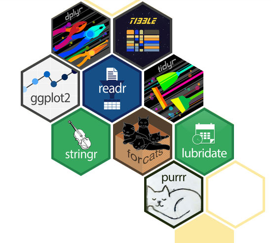
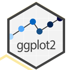
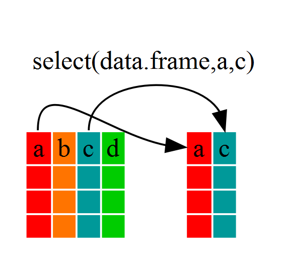
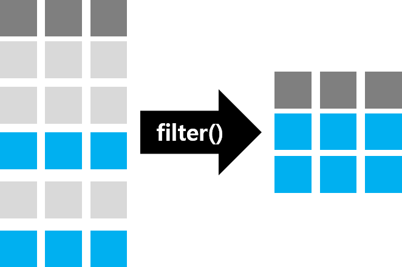
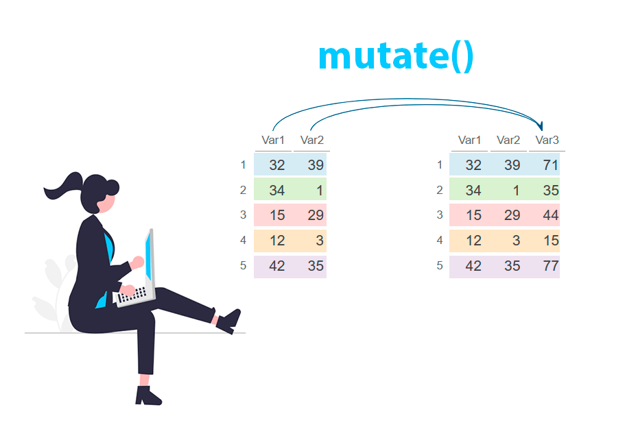
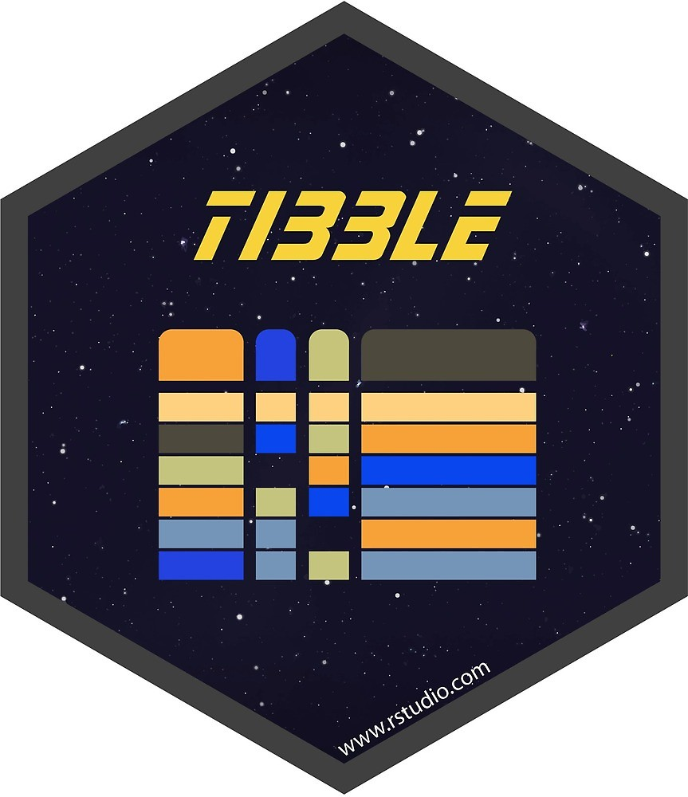
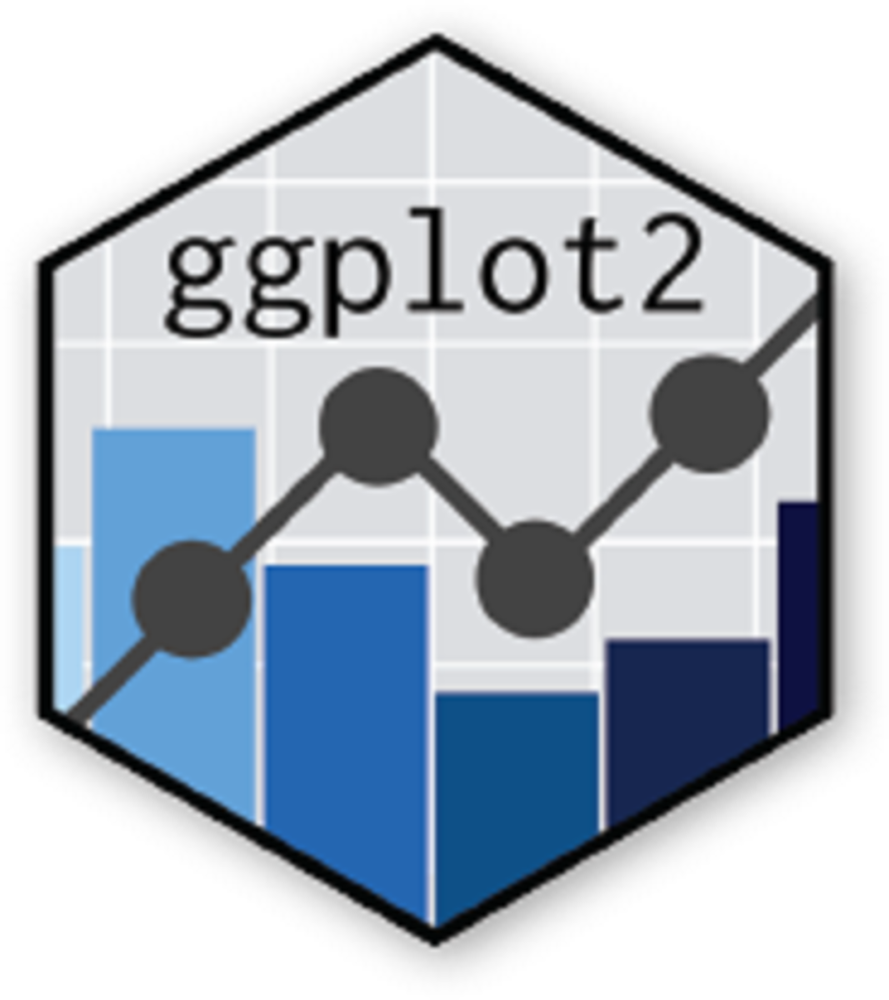
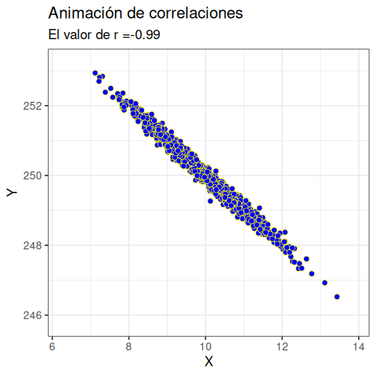

# Qué es Tidyverse?

{ width=50% }


Es una colección para ciencia de datos.


## Autores


<div style= "float:left;position: relative; top: -20px;">
{ width=55% }
</div>
Hadley Wickham, Mara Averick, Jennifer Bryan, Winston Chang, Lucy D’Agostino McGowan, Romain François, Garrett Grolemund, Alex Hayes, Lionel Henry, Jim Hester, Max Kuhn, Thomas Lin Pedersen, Evan Miller, Stephan Milton Bache, Kirill Müller, Jeroen Ooms, David Robinson, Dana Paige Seidel, Vitalie Spinu, Kohske Takahashi, Davis Vaughan, Claus Wilke, Kara Woo, Hiroaki Yutani


## ¿Qué significa **tidyverse**?

::: {.columns}

::: {.column width="50%"}

### **Tidy**

> **"Tidy"** significa **ordenado**.

Hace referencia a los **datos tidy**,  concepto formalizado por Hadley Wickham (2014):

- Cada **variable** ocupa una columna.
- Cada **observación** ocupa una fila.
- Cada **valor** ocupa una celda.

Facilitando  la manipulación y visualización.

:::

::: {.column width="50%"}

### **Verse**

> **"Verse"** proviene de **universe** (universo).

Representa un **ecosistema de paquetes** diseñados para trabajar de manera coherente y compartir una misma filosofía:

- Sintaxis uniforme.
- Funciones consistentes.
- Objetos compatibles.
- Flujo de trabajo integrado.

Por ello, **tidyverse** puede interpretarse como el **universo de herramientas para trabajar con datos tidy**.

:::

:::

::: {.callout-tip}
### Idea central

**tidyverse = tidy + universe**

> Un conjunto de paquetes diseñados para analizar datos ordenados mediante una gramática consistente y un flujo de trabajo integrado.
:::


# Paquetes del Core 


El core de tidyverse está compuesto por 8 paquetes:


## ggplot2

{ width=50% }

Creación de gráficos mediante una gramática de capas (Grammar of Graphics).


## dplyr


{ width=50% }

Manipulación y transformación de datos mediante verbos como  `select()`, `filter()`, `mutate()` y `summarise()`.


## tidyr

{ width=50% }

Organización de datos en formato tidy mediante operaciones de pivoteo, separación y combinación de columnas.


## readr

{ width=50% }


Importación rápida y eficiente de archivos de texto delimitados (CSV, TSV, etc.).


## purrr


{ width=50% }


Programación funcional para aplicar funciones de manera consistente sobre listas y vectores.


## tibble 


{ width=50% }

Versión moderna de los data frames, con impresión y manejo de datos más robustos.


## stringr


{ width=50% }

Manipulación uniforme y sencilla de cadenas de caracteres mediante expresiones regulares.


## forcats

{ width=50% }

Manejo y reordenamiento de factores.


## lubridate

{ width=50% }

Manipulación y cálculo con fechas y horas.


## Otros paquetes del ecosistema tidyverse

| **Paquete** | **Aplicación** |
|:-----------|:---------------|
| `readxl` | Importar archivos Excel |
| `haven` | Importar SPSS, SAS y Stata |
| `hms` | Manejo de tiempos |
| `magrittr` | Operador `%>%` (*pipe*) |
| `googlesheets4` | Acceso a Google Sheets |
| `dbplyr` | Bases de datos con `dplyr` |
| `dtplyr` | Alto rendimiento con `data.table` |


## Ventajas de utilizar **tidyverse** frente a R base

::: {.incremental}

- Sintaxis más **clara, consistente y legible**.
- Funciones con una **gramática uniforme**, lo que facilita el aprendizaje.
- Uso de **verbos intuitivos** (`select()`, `filter()`, `mutate()`, `summarise()`, etc.).
- Permite **encadenar operaciones** mediante tuberías (`|>` o `%>%`), mejorando la lectura del código.
- Trabaja de forma nativa con **tibbles**, una versión moderna de los *data frames*.
- Excelente integración entre los paquetes del ecosistema.
- Reduce la cantidad de código necesario para realizar tareas complejas.
- Favorece la **reproducibilidad** y el mantenimiento del código.


:::


## Debo sustituir R base por tidyverse?

> Tidyverse no reemplaza a R base; proporciona una gramática coherente que simplifica la manipulación, visualización e importación de datos, haciendo el código más legible, reproducible y fácil de mantener.

```{r}
#| message: true
library(tidyverse)
```


# Manejo de datos

El paquete **dplyr** presenta una gramática para la manipulación de datos (H. Wickham y Francois 2020). Este paquete se carga cuando se ejecuta la biblioteca (tidyverse). 


{ width=45% }

```{r warning=FALSE, message=FALSE, echo=FALSE}
library(dplyr)
```


## Gramática del manejo de datos

Hadley Wickham, uno de los autores de dplyr y tidyverse, ha identificado cinco verbos para trabajar con datos en un marco de datos:
 

> -   `select()`: toma un subconjunto de las columnas (P.e., features, variables)
> -   `filter()`: toma un subconjunto de las filas    (P.e., observaciones)
> -   `mutate()`: agrega o modifica columnas existente.
> -   `arrange()`: ordena las filas.
> -   `summarize()`: resumir los datos a través de las filas (Agrupa de acuerdo a algún criterio)


## Datos prestaciones médicas 
```{r}
datos_medicos <- readODS::read_ods("datos/datos_medicos.ods")
#head(datos_medicos)
#tail(datos_medicos)
glimpse(datos_medicos)

```


## Seleccionar un subconjunto de columnas

Uno de los verbos más simples..

## Utilizar el verbo select()


En que consiste su utilizacion


## Seleccionar los datos médicos


```{r}
pacientes_centro_profesional <- select(datos_medicos, Centro, Profesional, "0111")
pacientes_centro_profesional
```


## Seleccionar los datos médicos utilizando ":"


```{r}
pacientes_centro_profesional <- select(datos_medicos, Profesional:"0101")
pacientes_centro_profesional
```


## Seleccionar solo lógicos


```{r}
pacientes_centro_profesional2 <- select(datos_medicos, where(is.numeric))
pacientes_centro_profesional2
```


## Criterios de selección


Funciones auxiliares de selección.


> - `everything()`: Selecciona todas las variables
> - `last_col()`: Selecciona la última variable
> - `group_cols()` Selecciona grupo de columnas
> - `starts_with()` Matchea las columnas que comienzan con un prefijo.
> - `ends_with()` Matchea las columnas que terminan con un sufijo.
> - `starts_with()` Matchea las columnas que comienzan con un prefijo.
> - `contains()` contiene un string.
> - `matches()` Expresion regular.


## Utilizar el verbo filter()


En este caso entonces



## Filtrar por Profesional


```{r}
filter(pacientes_centro_profesional, 
       Profesional == "Carlos Pica")
```


## Filtrar con más de un criterio

```{r}
filter(pacientes_centro_profesional, 
       Profesional == "Carlos Pica" & Centro == "Maquinchao")
```

## Mutate y rename


*mutate* realiza modificaciones y cálculos sobre las columnas.
{width=65%}


## Renombrar una columna de la tabla de datos

En este caso la prestación "0111" es indicador del número de pacientes.

```{r}
datos_medicos_ren  <- rename(datos_medicos, 
                             Pacientes = "0111")
datos_medicos_ren 
```


# Tuberías o *pipes* {data-background="./figuras/laniakea.jpg"}

Se pueden encadenar estos verbos entre sí.

## Operador  |> 

Uso del operador |>  (pipe).


```{r}
datos_medicos |>  select(Centro, Profesional, "0111") |>  
  filter( Profesional == "Carlos Pica" & Centro == "Maquinchao")
  
```


## Ventajas


> - Alternativa a las funciones anidadas
> - Mejora la legibilidad
> - Ahorra espacio en memoria


## Resumiendo la información: Aplicando el verbo summarize

El verbo summarize() va acompañado de la función "grouped_by"

```{r}
datos_medicos_ren |>  group_by(Centro) |> 
  summarize(N = n(),
            Total = sum(Pacientes, na.rm = T)
            )
```


## Resumen condicional y datos faltantes

Sumar con presencia de  datos faltante o NA


```{r}
datos_medicos |>  
  group_by(Centro) |>  
  summarise_if(is.numeric,sum, na.rm =TRUE)
```


## Resumiendo información con más de un criterio

```{r message=FALSE}
datos_medicos_ren |>  
  group_by(Centro, Profesional) |>  
  summarize(N = n(), 
            Total = sum(Pacientes, na.rm = T)
)
```


## Total de pacientes atendidos por centro

```{r}
datos_medicos_ren |>  
  select(c("Centro","Pacientes"))  |> 
  group_by(Centro)  |>   
  summarise_if(is.numeric,sum, na.rm=TRUE)
```


## Configuración del Pipe Nativo `|>`

Sustituir `%>%` por `|>` al usar el atajo de teclado en **RStudio**:

::: {.columns}

::: {.column width="60%"}
### Pasos de configuración

1. Ir a **Tools** $\rightarrow$ **Global Options...**
2. En el panel izquierdo, seleccionar **Code**.
3. En la pestaña **Editing**, activar:  
   `[x] Use native pipe operator, |> (requires R 4.1+)`
4. Confirmar con **Apply** y **OK**.
:::

::: {.column width="40%"}
### Atajo de teclado

* **Windows / Linux:**  
  `Ctrl` + `Shift` + `M`
* **Mac:**  
  `Cmd` + `Shift` + `M`

::: {.callout-note}
### Requisito
Requiere versión de **R $\ge$ 4.1.0**.
:::
:::

:::


## Presentación en tablas


```{r message=FALSE}
library(kableExtra)
datos_med <-  datos_medicos_ren |> select(c("Centro","Pacientes")) |>  group_by(Centro) |>  summarise(tota_pacientes=sum(Pacientes,na.rm=TRUE)) 
datos_med |>   kable(booktabs = T) |>   kable_styling() |> row_spec(which.max(datos_med$tota_pacientes), bold = T, color = "white", background = "red") 
```


## Otras tablas


```{r message=FALSE}
library(kableExtra)
datos_medicos_ren |>  
  select(c("Centro","Pacientes", "Profesional")) |>  group_by(Centro) |>  summarise(total_pacientes=sum(Pacientes,na.rm=TRUE))
```


## Renombrar columnas: rename


```{r}
datos_medicos_resumen <- datos_medicos |> 
  group_by(Centro)  |> 
  summarise_if(is.numeric,sum, na.rm=TRUE)
datos_medicos_resumen_r <- datos_medicos_resumen   |> 
  rename(Pacientes = "0111")
datos_medicos_resumen_r 
```


## Acción de Mutate


```{r}
datos_medicos_resumen_r |> 
  select("Pacientes")  |> 
  mutate(Pacientes_dia = Pacientes/20)
```


# Tidy datos

{ width=40% }

Transformar la estructura de los datos.


## Características de los "tidy" datos


> 1. Las filas, llamadas casos u observaciones, se refieren a un tipo de cosa específico, único y similar, por ejemplo, centros.
> 2. Las columnas, llamadas variables, tienen el mismo tipo de valor registrado para cada fila. Por ejemplo, Cantidad  da el número de prestaciones; prestación hace referencia a la práctica médica.


## Tablas a lo largo y a lo ancho


```{r}
tot_centro_pres <- datos_medicos |>
  group_by(Centro)  |> 
  summarise_if(is.numeric, sum, na.rm = TRUE)
tot_centro_pres
```

## Utilizando la función pivot_longer


```{r}
library(tidyr)
tot_centro_pres_long = tot_centro_pres |> 
 pivot_longer(!Centro, names_to = "Presta", values_to = "Cantidad")
tot_centro_pres_long 
```

## Formato long vs. wide

Existen motivos para preferir el formato *long* al formato *wide*.

> - Es una forma más eficiente para el almacenamiento y recuperación de los datos.
> - Es más conveniente para el análisis de datos. 
> - Es más escalable,  la adición de una segunda variable aporta otra columna.


# Manejo de múltiples tablas

{ width=50% }

## left_join()
Se devuelven todas las filas de la primera tabla, independientemente de si hay una coincidencia en la segunda tabla.

## inner_join()
 Hacer coincidir las filas de la tabla 1  con las filas de la tabla 2 que tienen los valores correspondientes para la columna de  ambas tablas.  Esto se logra con la función inner_join ().

## Tablas de códigos

```{r}
codigos <-  readODS::read_ods("datos/Codigos.ods")
glimpse(codigos)
```

## Cruzar las tablas mediante una columna

```{r}
tot_centro_pres_long_rename <-  tot_centro_pres_long %>% rename(Codigos=Presta)  
tot_centro_pres_long_join <-  inner_join(tot_centro_pres_long_rename, codigos, by = "Codigos")
tot_centro_pres_long_join
```


## Probar que es igual


Es muy importante chequear que la tabla original tiene el mismo número de filas que la tabla final.


```{r}
all.equal(nrow(tot_centro_pres_long_join), nrow(tot_centro_pres_long_rename))
```


## Concatenar con gráficos


```{r fig.height=4.65, fig.width=9.5}
tot_centro_pres_long_join |>  ggplot(aes(x=Centro, y = Descripcion)) + 
  geom_tile(aes(fill=Cantidad)) +  scale_fill_distiller(palette = "YlGnBu", direction = 1)  +
  labs(title = "Prestación por Centro de Salud", y = "Prestación")
```


# Datos con fechas

Es difícil trabajar con fechas en R!
librería lubridate()
{ width=50% }

## Retomando los datos médicos
```{r message=FALSE}
library(lubridate)
datos_medicos
```


## Calcular la prestación por fecha


```{r}
tot_fecha_pres <-  datos_medicos |>   group_by(Fecha)  |>  
  summarise_if(is.numeric, sum, na.rm = TRUE)
tot_fecha_pres_longer = tot_fecha_pres  %>%
  pivot_longer(!Fecha, names_to = "Prestacion", values_to = "Cantidad")
tot_fecha_pres_longer 
```


## Utilizar fechas

```{r}
tot_fecha_pres_longer <- tot_fecha_pres_longer |>  mutate(diames = as.Date(Fecha, '%d/%m/%Y'))
tot_fecha_pres_longer
```

## Extraer el día de mes

```{r}
tot_fecha_pres_longer2  <- tot_fecha_pres_longer |>  mutate(dia=mday(diames))
tot_fecha_pres_longer2 
```


## Día de la semana

```{r}
tot_fecha_pres_longer2 <- tot_fecha_pres_longer2 |>  mutate(diasemana=wday(diames, label = T))
tot_fecha_pres_longer2
```


## Día del año

```{r}
tot_fecha_pres_longer2 <- tot_fecha_pres_longer2 |>  mutate(diasanio=yday(diames))
tot_fecha_pres_longer2
```


## Sumar prestaciones por día de la semana

```{r warning=FALSE}
tot_fecha_pres_longer2  |>  group_by(diasemana) |>   filter(between(diasemana,"lun", "vie")) |>  summarise(Prestacion_diasemana = sum(Cantidad))
```

# Estructuras de datos

Dos importantes: **dataframes** y listas
 
 { width=50% }


## Marco de datos o lista??

Creo un marco de datos
```{r}
dfm <- data.frame(Frutas = c("banana", "pera", "cereza"))
dfm$y <- matrix(1:9, nrow = 3)
dfm$z <- data.frame(a = 3:1, b = letters[1:3], stringsAsFactors = FALSE)
str(dfm)
```
A diferencia de una lista normal, un marco de datos tiene una restricción adicional: la longitud de cada uno de sus vectores debe ser la misma.


## Qué sucede con los tibbles
```{r}
dfm <- tibble(
  Frutas = c("banana", "pera", "cereza")
)
dfm$y <- matrix(1:9, nrow = 3)
dfm$z <- data.frame(a = 3:1, b = letters[1:3], stringsAsFactors = FALSE)

str(dfm)
```

## Qué son los tibbles?


* Una reinvención moderna del marco de datos, están diseñados para ser reemplazos directos de los marcos de datos.  Una forma concisa de definir los tibbles de acuerdo al autor "son perezosos y hoscos: hacen menos y se quejan más". 


* Tibbles son proporcionados por el paquete tibble y comparten la misma estructura que los marcos de datos. La única diferencia es que el vector de clase es más largo e incluye tbl_df. Esto permite que tibbles se comporte de manera diferente. 


## Diferencias
Otra  diferencia  es que los tibbles nunca fuerzan (coarce) su entrada ):

```{r}
df1 <- data.frame(
  x = 1:3,
  y = c("a", "b", "c")
)
str(df1)

df2 <- tibble(
  x = 1:3, 
  y = c("a", "b", "c")
)
str(df2)
```

## Diferencias


Los data frames transforman sintácticamente los nombres, los tibbles no.

```{r}
names(data.frame(`1` = 1))
#> [1] "X1"

names(tibble(`1` = 1))
#> [1] "1"
```

## Diferencias  en el "reciclado" del vector
```{r error=T}
data.frame(x = 1:4, y = 1:2)
#>   x y
#> 1 1 1
#> 2 2 2
#> 3 3 1
#> 4 4 2
```

## Diferencias en el "reciclado" del vector

```{r error=T}
tibble(x = 1:4, y = 1)
#> # A tibble: 4 x 2
#>       x     y
#>   <int> <dbl>
#> 1     1     1
#> 2     2     1
#> 3     3     1
#> 4     4     1
tibble(x = 1:4, y = 1:2)
#> Error: Tibble columns must have compatible sizes.
#> * Size 4: Existing data.
#> * Size 2: Column `y`.
#> ℹ Only values of size one are recycled.
```

## Diferencia más importante

 tibble () le permite hacer referencia a las variables creadas durante la construcción:
 
 
```{r}
tibble(
  x = 1:3,
  y = x * 2)
```


# Importar datos 

Importar y Exportar datos 
 
 { width=70% }


## Distintas opciones

La manera de importar datos más común es:

  * desde un archivo separado por comas.
  * desde un archivo excel.
  * desde una hoja de cálculo en googledrive.


## Importar datos separados por comas

Se utiliza dentro de tidyverse la librería **readr**

```{r}
library(readr)
datos_ovejas <- read.csv2("datos/datos_ovejas.csv")
```


## Importar datos desde excel


Se utiliza dentro de tidyverse la librería **readr**
```{r}
library(readxl)
datos_morfometricos <- read_excel("datos/Datos_morfometricos_final.xlsx")
glimpse(datos_morfometricos)
```


## Importar datos desde googlesheet


Se usa muy frecuentemente desde hojas de google drive.
```{r, eval=FALSE}
library(googlesheets4)
read_sheet("https://docs.google.com/spreadsheets/d/1ckWKwKwM-U8Zq5VKPW81aJeJCLiFcjsDSum9G19B_mQ/edit?usp=sharing")
```


# Gráficos

{ width=50% }


## Librería "ggplot2"


> Construir gráficos en capas.

> -  *aesthetic* es un mapeo explícito entre una variable y las señales visuales que representan sus valores.
> -  *geom*  objeto geométrico
> -  *gliph* es el elemento gráfico básico que representa un caso (ó también "marca" y "símbolo").
> -  *cues* si hay más de dos variables presentes, la estética adicional puede generar señales visuales adicionales.

```{r echo=FALSE}
library(ggplot2)
```


## Sintaxis

```{r eval=FALSE}
ggplot(data = <DATOS>) +
  <GEOM_FUNCIÓN>(mapping = aes(<MAPEOS>))
```


## Datos: relación peso diámetro.

```{r}
load("datos/pesodiamDB.RData")
tibble::as_tibble(pesodiamtod)
```


## Comenzando el gráfico

```{r message=FALSE, fig.height=5}
graf1 <- ggplot(pesodiamtod, aes(x=Diametro, y=Peso)) 
graf1

```


##  geom_point()

```{r message=FALSE, fig.height=5}
graf1 + geom_point(size=3 )
```

## Densidad de datos


```{r message=FALSE, fig.height=5}
graf1 + geom_point(size=3, alpha = 0.1)
```


## Grafica por especie 
Utilizando atributos de los *Glyphs* para diferenciar cultivares.


```{r , fig.height=4.55}
graf1 + geom_point(aes(colour=variedad),size=3)
```


## Utilizando otros glyph

Se cambia el glyph cambiando la función p.e. geom_label()

```{r ,fig.height=4.5}
graf1 + geom_text(aes(label = variedad, colour=variedad),size=3)
```


## Escalas

```{r message=FALSE,fig.height=5}
graf1 + geom_point(aes(colour=variedad),size=3) + 
  coord_trans(x = "log", y = "log")
```

## Escalas en diferente sistema


```{r message=FALSE, fig.height=5}
graf1 + geom_point(aes(colour=variedad),size=3) + 
  scale_x_continuous(trans='log2') +  scale_y_continuous(trans='log2')

```


## Agregar ticks en X


```{r message=FALSE, fig.height=5}
graf1 + geom_point(aes(colour=variedad),size=3) + 
  scale_x_continuous(breaks = seq(42, 98, by = 8), trans='log2') + scale_y_continuous(trans='log2')

```


## Identificar entre  especies 

La función ifelse es un condicional vectorizado.

```{r}
pesodiamtod$Especie <- ifelse(pesodiamtod$variedad %in% c("williams", "beurre_d_anjou", "packhams_triumph"),"Peras", "Manzanas")
head(pesodiamtod,4)
```


## Facetas


- Son múltiples paneles dispuestos uno al lado de otro. 
- Se utiliza cuando el gráfico se torna difícil de leer.
- Hay una nueva variable clasificatoria y no existen mas glyphs.


```{r echo=FALSE}
#graf1 + geom_point(aes(colour=variedad),size=3) + 
#  scale_x_continuous(trans='log2') +  scale_y_continuous(trans='log2')+facet_wrap(~Especie)
#Error: At least one layer must contain all faceting variables: `Especie`. * Plot is missing `Especie` * Layer 1 is missing `Especie`
```

## Actualizar objeto guardado 

```{r fig.height=4.5}
graf2  <- ggplot(pesodiamtod, aes(x=Diametro, y=Peso))
graf2 + geom_point(aes(colour=variedad),size=3) + 
  scale_x_continuous(breaks = seq(42, 98, by = 8),trans='log2') +  scale_y_continuous(trans='log2')+facet_wrap(~Especie)
```


## Gráfica por especie y variedad

```{r fig.height=4.5}
ggplot(pesodiamtod, aes(x=Diametro, y=Peso, colour = variedad)) + geom_point()+
   scale_x_continuous(breaks = seq(42, 98, by = 8),trans='log2') +
  scale_y_continuous(trans='log2')+facet_grid(variedad~Especie)
```


## Gráfica por especie y variedad


```{r fig.height=4.5, message=FALSE}
ggplot(pesodiamtod, aes(x=Diametro, y=Peso, colour = variedad)) + geom_point()+
   scale_x_continuous(breaks = seq(42, 98, by = 8),trans='log2') +
  scale_y_continuous(trans='log2') + facet_grid(variedad~Especie)+ geom_smooth(method = lm, se=F, colour="black")
```


## themes

> Son una forma  de personalizar los componentes que no son datos de sus gráficos: títulos, etiquetas, fuentes, fondo, líneas de cuadrícula y leyendas. 

Hay temas completos disponibles como  
* theme_bw()
* theme_minimal() 
* theme_gray() y más. 


## themes preconfigurados 1


```{r fig.height=4.5}
graf2  <- ggplot(pesodiamtod, aes(x=Diametro, y=Peso))
graf2 + geom_point(aes(colour=variedad),size=3) + 
  scale_x_continuous(breaks = seq(42, 98, by = 8),trans='log2') +  scale_y_continuous(trans='log2')+facet_wrap(~Especie) + theme_bw()
```


## themes preconfigurados 2


```{r fig.height=4.5}
graf2  <- ggplot(pesodiamtod, aes(x=Diametro, y=Peso))
graf2 + geom_point(aes(colour=variedad),size=3) + 
  scale_x_continuous(breaks = seq(42, 98, by = 8),trans='log2') +  scale_y_continuous(trans='log2')+facet_wrap(~Especie) + theme_classic()
```


## themes preconfigurados 3


```{r fig.height=4.5}
graf2  <- ggplot(pesodiamtod, aes(x=Diametro, y=Peso))
graf2 + geom_point(aes(colour=variedad),size=3) + 
  scale_x_continuous(breaks = seq(42, 98, by = 8),trans='log2') +  scale_y_continuous(trans='log2')+facet_wrap(~Especie) + theme_minimal()
```


## Animaciones con ggplot2

{width=65%}


# Fin  {data-background="./figuras/sunsetmars.jpg"}


# Bibliografía


## Bibliografía específica


*  Baumer, B. S., Kaplan, D.T. and Horton, N. J.
  \emph{``Modern Data Science with R''}.3rd Edition CRC Press.
   <https://mdsr-book.github.io/mdsr3e/>
*  Wickham, Hadley. 2014. “Tidy Data.” The Journal of Statistical Software 59.
*  Wickham, H.  \emph{`` ggplot2: Elegant Graphics for Data Analysis ''}.  2023. 3rd Edition.(in progress)<https://ggplot2-book.org/>
 * Wickham, H.; Cetinkay-Rundel, M. ; Grolemund,G.
   {\em ``R for Data Science''}.2023. Second Edition.
    <https://r4ds.hadley.nz/>
* Tidyverse  <https://www.tidyverse.org/>